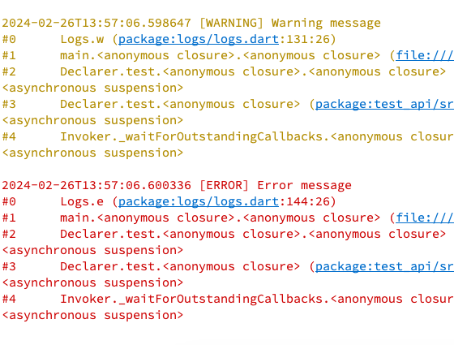

# Logs
Small, feature-rich logging package for Dart and Flutter.
Written in pure Dart, with no dependencies.

## Features

- [x] Multiple Log Levels: Define distinct log levels to categorize messages.
- [x] Formatted Console Logs: Print logs to the console in a structured and readable format with color-coded log levels
- [x] Selective Output: Control console output based on log levels to streamline debugging workflows
- [x] In-Memory Log Storage: Store logs in memory for post-execution analysis and troubleshooting
- [x] Enhanced Debugging: Optionally include and print stack traces alongside log messages to expedite debugging

## Getting started

1. Install the package
2. Import the package
3. Create a new instance of `Logs` and start logging. Use the same instance across your application to maintain a single log history.

## Screenshots


View structured and coloured output in console



Optionally include stack trace in logs

## Usage

Get started with no configuration:

```dart
import 'package:logs/logs.dart';

void main() {
    final log = Logs();
    log.v('This is a verbose message');
    log.d('This is a debug message');
    log.i('This is an info message');
    log.w('This is a warning message');
    log.e('This is an error message', includeStackTrace: true); // Optionally include stack trace
}
```

Customise output and storage:

```dart
import 'package:logs/logs.dart';

void main() {
    final log = Logs(
        storeLogLevel: LogLevel.warning, // Store logs with warning level and above
        printLogLevelWhenDebug: LogLevel.verbose, // Print logs with verbose level and above in debug mode
        printLogLevelWhenRelease: LogLevel.error, // Print logs with error level and above in release mode
        storeLimit: 500, // Store up to 500 logs in memory
    );

    log.v('This is a verbose message'); // Will be printed in debug mode, but not stored
    log.d('This is a debug message'); // Will be printed in debug mode, but not stored
    log.i('This is an info message'); // Will be printed in debug mode, but not stored
    log.w('This is a warning message', includeStackTrace: true); // Optionally include stack trace
    log.e('This is an error message', includeStackTrace: true); // Optionally include stack trace
}
```

## Additional information
None at the moment.
